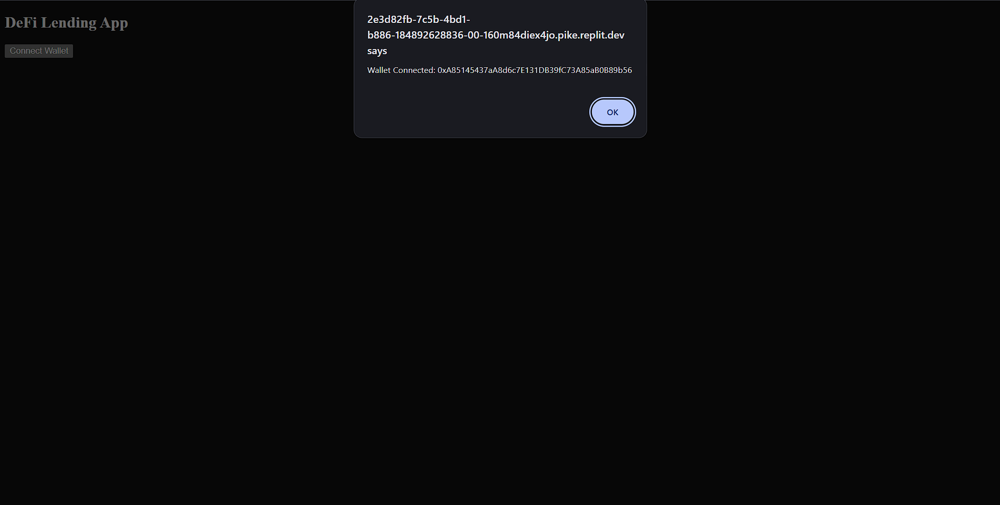
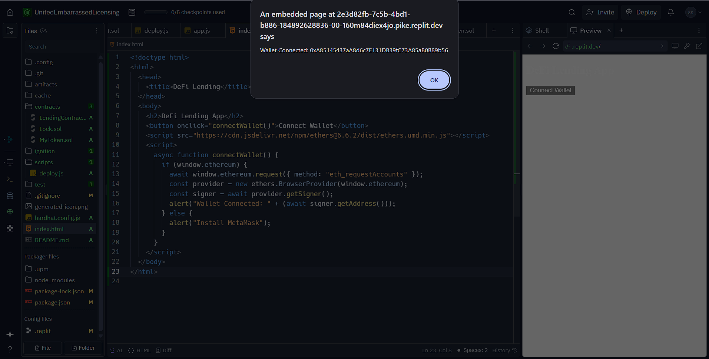

# Task 3 – DeFi Lending and Borrowing DApp

## Description
This project is part of the CodTech Blockchain Internship Task 3. It involves building a decentralized finance (DeFi) application that allows users to lend and borrow ERC-20 tokens with dynamically calculated interest.

## Tools Used
- Solidity
- Hardhat
- Ethers.js
- MetaMask
- Replit (HTML + Node.js environment)

## Features
- Users can lend and borrow ERC-20 tokens
- Wallet connection via MetaMask
- Frontend built using a single index.html file

## Smart Contract Deployment

1. Compile the smart contract:
   bash
   npx hardhat compile

2. Deploy the contract using Hardhat local testnet:
   bash
   npx hardhat run scripts/deploy.js

3. Deployment Output:

   ✅ LendingContract deployed to:
   0x5FbDB2315678afecb367f032d93F642f64180aa3

## Frontend Setup (Replit)

- The DApp interface is created using index.html only.
- To serve the frontend correctly, use this .replit configuration:

   run = "npx serve ./"

- Click *"Run", then open the **Preview* or *Open in new tab* to interact with the app.

## Screenshots

### 🖼 DApp UI with Wallet Button

### 🦊 MetaMask Connected Confirmation

> ✅ Note: This project uses local deployment and runs inside Replit using serve. Wallet connected using MetaMask and Ethers.js from index.html.